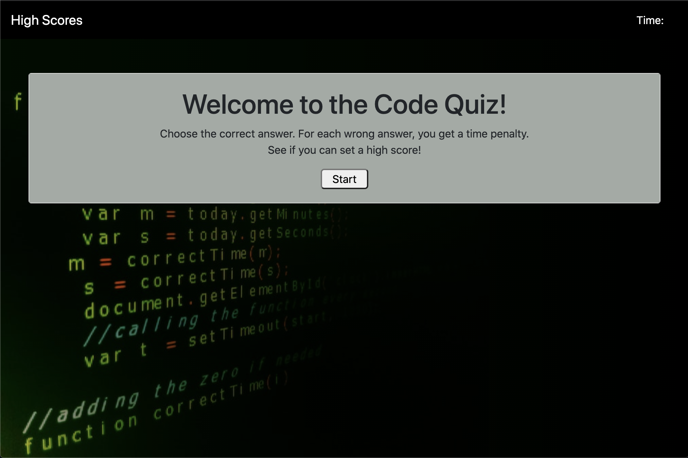
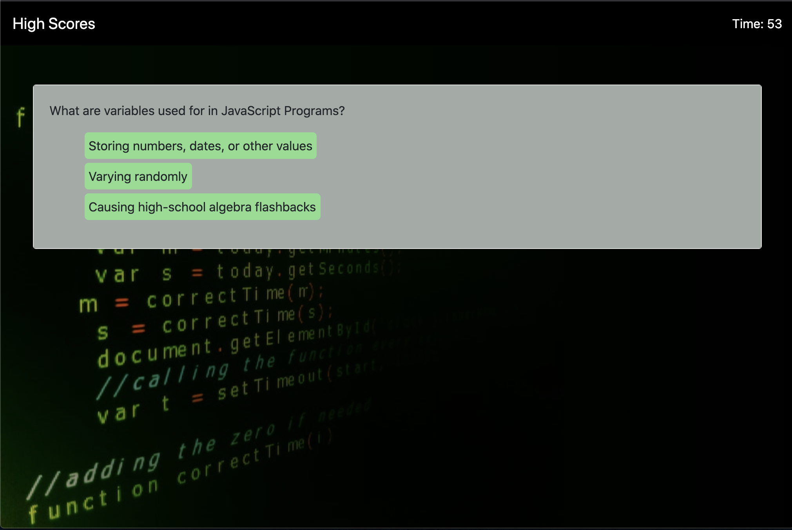
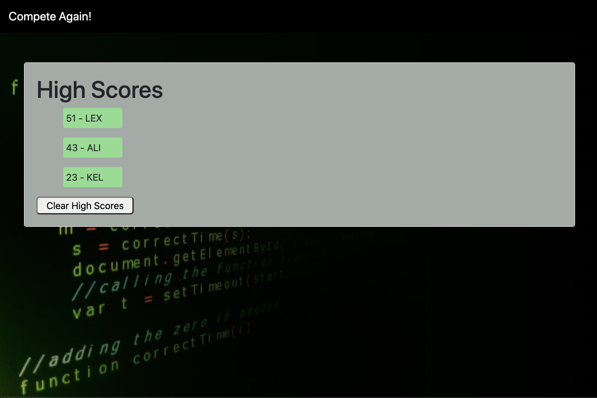

# Code Quiz

[Deployed Project](https://github.com/puakehaulani/4-Code-Quiz)  
[Github Repo](https://puakehaulani.github.io/4-Code-Quiz/)

## About the Project

**Code Quiz** is Homework 4 for UW Coding Bootcamp. We were given a [User Story](https://uwa.bootcampcontent.com/UWA-Bootcamp/uw-sea-fsf-pt-08-2020-u-c/tree/master/class-content/04-Web-APIs/02-Homework#user-story) and [Acceptance Criteria](https://uwa.bootcampcontent.com/UWA-Bootcamp/uw-sea-fsf-pt-08-2020-u-c/tree/master/class-content/04-Web-APIs/02-Homework#acceptance-criteria) to follow. We then had to build the quiz from the ground up.

  

  


### Built With

Javascript
Bootstrap

## Installation

Clone the repo

```bash
git clone git@github.com:puakehaulani/4-Code-Quiz.git
```

## Contributing

Pull requests are welcome. For major changes, please open an issue first to discuss what you would like to change.

## License

© 2019 Trilogy Education Services, a 2U, Inc. brand.
All Rights Reserved.

## Project Status

Currently this homework assignment is completed and submitted for grade.
