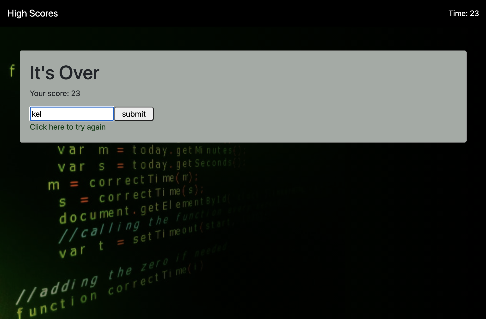

# Code Quiz

[Deployed Project](https://puakehaulani.github.io/4-Code-Quiz/)  
[Github Repo](https://github.com/puakehaulani/4-Code-Quiz)

## About the Project

**Code Quiz** is Homework 4 for UW Coding Bootcamp. We were given a [User Story](https://uwa.bootcampcontent.com/UWA-Bootcamp/uw-sea-fsf-pt-08-2020-u-c/tree/master/class-content/04-Web-APIs/02-Homework#user-story) and [Acceptance Criteria](https://uwa.bootcampcontent.com/UWA-Bootcamp/uw-sea-fsf-pt-08-2020-u-c/tree/master/class-content/04-Web-APIs/02-Homework#acceptance-criteria) to follow. We then had to build the quiz from the ground up.

  

  


### Built With

Javascript  
Bootstrap

## Usage

To compete, press the start button. The timer is set to 60 seconds, and counts down on start button click. Choose the correct answer for each question. If the correct answer is chosen, the quiz proceeds to the next question. If the answer is incorrect, the timer is deducted by 25 seconds. The quiz is over when all the questions are answered or the timer reaches zero. The score is the time left when the quiz is over.  
Player initials can be entered at the end of the quiz, and are stored in local storage. The list of high scores can be accessed on the [High Score page](https://puakehaulani.github.io/4-Code-Quiz/highscores.html).

## Installation

Clone the repo

```bash
git clone git@github.com:puakehaulani/4-Code-Quiz.git
```

## Contributing

Pull requests are welcome. For major changes, please open an issue first to discuss what you would like to change.

## License

© 2019 Trilogy Education Services, a 2U, Inc. brand.
All Rights Reserved.

## Project Status

Currently this homework assignment is completed and submitted for grade.
